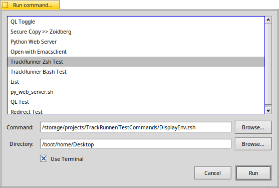
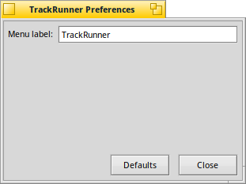

.. title:: TrackRunner User Guide

.. toctree::
   :maxdepth: 2
   :hidden:

.. contents:: User Guide Contents
   :depth: 3
   :local:
   :backlinks: none

Writing Scripts
---------------

TrackRunner will set the working directory and pass any selected files/folders as arguments to the command.  This
allows you to create small Tracker add-ons using many interpreted languages.  See the `Other Command Examples`_ section
for more.

.. code-block:: bash
   :caption: A simple bash example to display the selected arguments

   #!/bin/bash
   echo "PWD: $PWD"

   if (($# == 0)); then
      echo "No command line arguments given"
   else
      for ((i = 1; i <= $#; i++)); do
         echo "Arg $i: ${!i}"
      done
   fi

Tracker Context Menu
--------------------

.. image:: ../Screenshots/TrackRunnerMenu.png
   :alt: Tracker context menu
   :align: center

The context menu allows you to directly execute one of your saved commands as well as open the preferences or
management window.

.. note::
   Menuitem icons are only available when TrackRunner is built from source.  They are not available in packaged releases.

Command Management Window
-------------------------

.. image:: ../Screenshots/TrackRunnerCommands.png
   :alt: Command management window
   :align: center

The command management window allows you to add/edit/remove/sort shortcuts.

Command List
^^^^^^^^^^^^

The list of commands can be sorted by drag and drop.  This will change the order in the `Tracker Context Menu`_.

Command
^^^^^^^

In addition to passing command line arguments it is possible to use simple shell redirects (`>`) and the comment
character (`#`).  The python web server example from the screenshot above shows the comment character being used to
prevent any selected files from being read as arguments.  In this case the command only needs to start up in the
current folder.

*Commands with spaces in the file path will have to be escaped or quoted.*

Run in Terminal
^^^^^^^^^^^^^^^

Use the Terminal application to run the command so that the output can be viewed.

Command Select Window
---------------------

The command select window is activated by using the add-on in the traditional BeOS/Haiku way.  This is done by using
the shortcut `opt+alt+x` or `right click -> Add-ons -> TrackRunner` from a Tracker window or the desktop.  In this
window you may select and edit one of the existing commands or run a completely new command.

*Changes made to the command are temporary and not saved*

Command
^^^^^^^

Allows you to edit the command that will be executed.

Directory
^^^^^^^^^

Allows you to change the working directory to something other than where the add-on was executed from.

Run in Terminal
^^^^^^^^^^^^^^^

Use the Terminal application to run the command so that the output can be viewed.

Preferences
-----------

Menu label
^^^^^^^^^^

Allows you to change the menu label for the `Tracker Context Menu`_.

Use icons in menus
^^^^^^^^^^^^^^^^^^

Use the TrackerRunner logo in the top level menu and attempt to load icons for any custom commands.

*This feature is experimental and only enabled when TrackRunner is built from source*

Other Command Examples
----------------------

.. code-block:: bash
   :caption: Use scp to copy selected files/folders to a remote host

   #!/bin/bash

   if (($# == 0)); then
      echo "Nothing selected"
      exit
   fi

   scp -r "$@" myhost:

.. code-block:: bash
   :caption: Copy the selected file paths to the clipboard

   #!/bin/bash

   if (($# == 0)); then
      alert --stop "Nothing selected"
      exit
   fi

   for ((i = 1; i <= $#; i++)); do
      clipString+=" ${!i}"$'\n'
   done

   if [ -n "$clipString" ]; then
      clipboard -c "$clipString"
   fi

.. code-block:: bash
   :caption: Toggle a BFS attribute on/off

   #!/bin/bash

   if (($# == 0)); then
      alert --stop "Nothing selected"
      exit
   fi

   attribute="MyTestAttribute"

   for ((i = 1; i <= $#; i++)); do
      if catattr $attribute "${!i}" > /dev/null 2>& 1; then
         state="enabled"
         button="Disable"
      else
         state="disabled"
         button="Enable"
      fi

      if ! alert "$attribute is currently ${state} for ${!i}" "Cancel" $button > /dev/null; then
         if [[ $state == "disabled" ]]; then
            addattr -t int32 $attribute 1 "${!i}"
         else
            rmattr $attribute "${!i}"
         fi
      fi
   done
