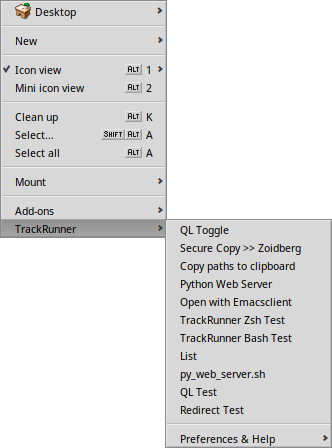

##  TrackRunner



_TrackRunner_ is a Tracker add-on for Haiku which runs commands on selected files and folders.  Each command is run with the working directory set and any selected files/folders are passed as arguments to the script.  This allows you to create small Tracker add-ons using interpreted languages like ruby, python, shell scripts, etc...

### Command Management Window


In addition to passing command line arguments it is possible to use simple shell redirects (`>`) and the comment character (`#`).  The python web server example from the screenshot above shows the comment character being used to prevent any selected files from being read as arguments.  In this case the command only needs to start up in the current folder.

*Commands with spaces in the file path will have to be escaped or quoted.*

### Command Select Window


When the add-on is executed the traditional way it will display a command selection window.  This is done by using the shortcut `opt+alt+x` or `right click -> Add-ons -> TrackRunner` from a Tracker window or the desktop.  In this window you may select and edit one of the existing commands or run a completely new command.  You may also change the working directory or adjust other options.

*Changes made to commands and options in this window are temporary. They do not get saved.*


------------------------------------------------------------


### Build Instructions

```
~> cd TrackRunner
~/TrackRunner> cmake .
~/TrackRunner> make
~/TrackRunner> make install
```
